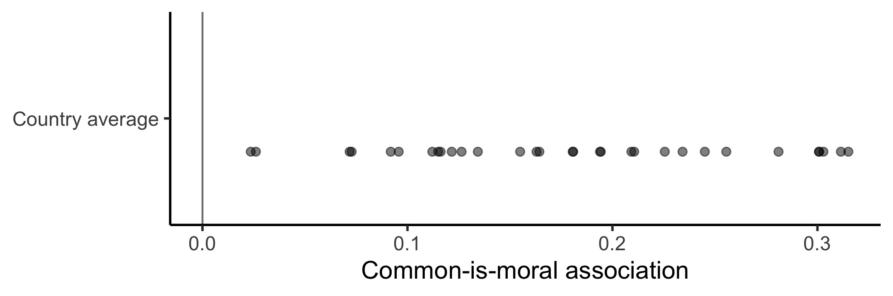
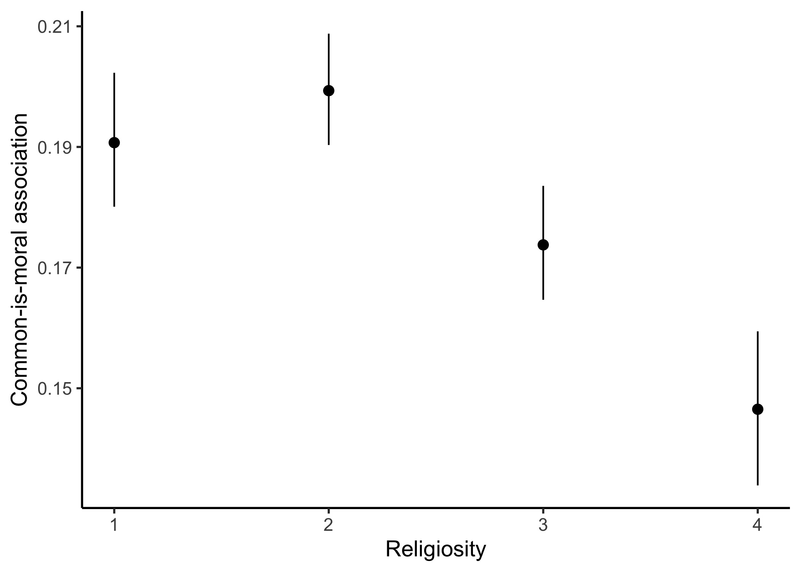
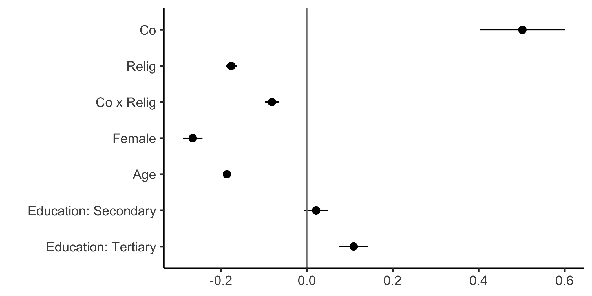
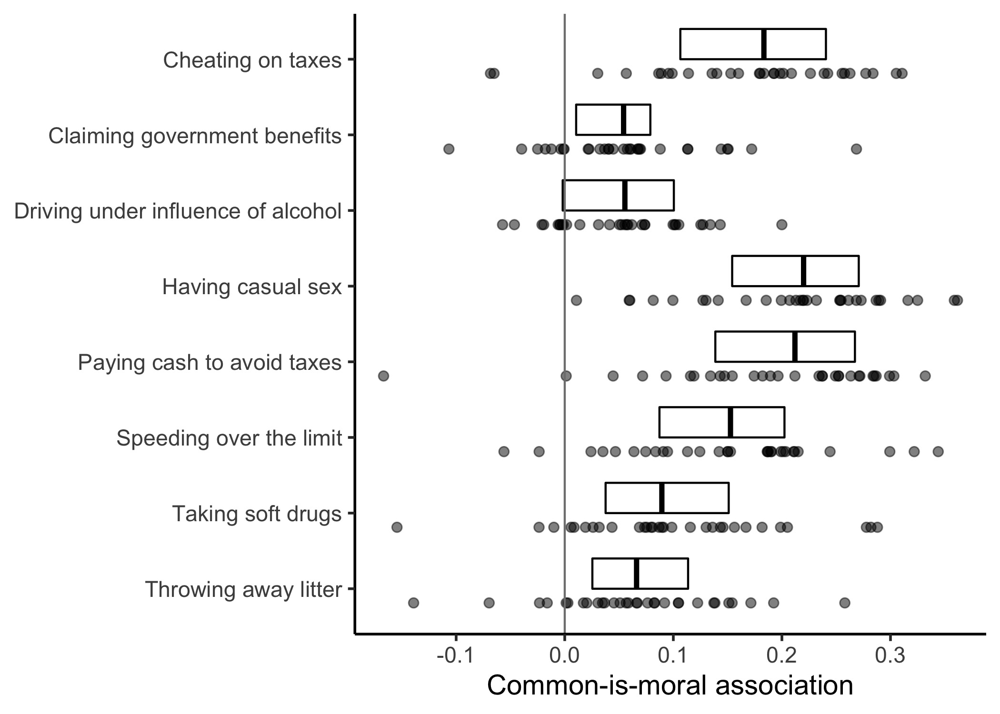
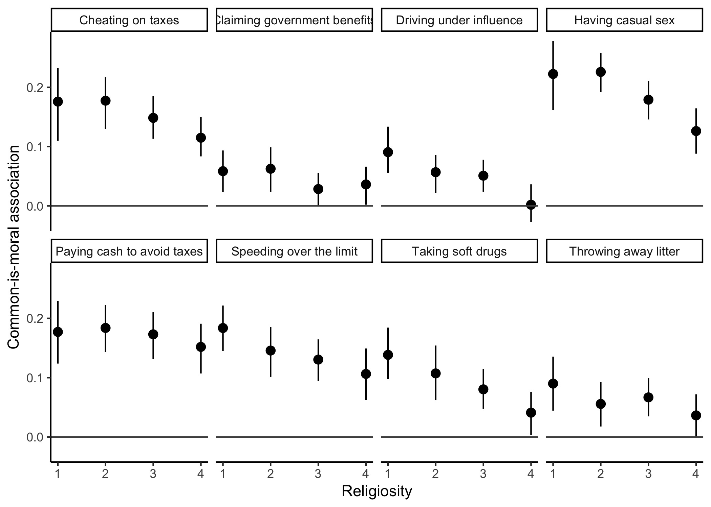
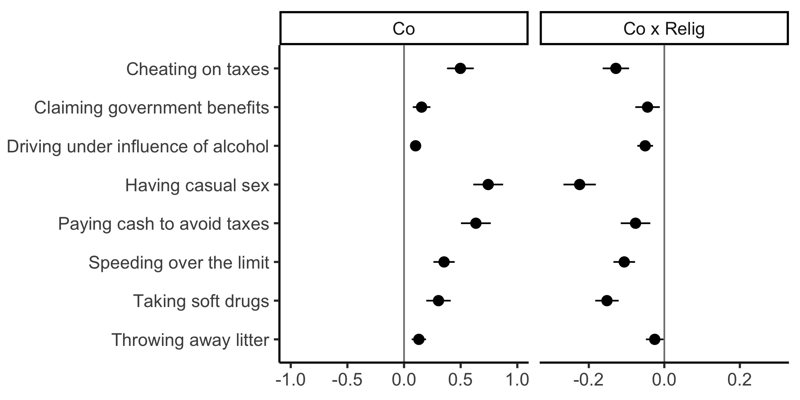
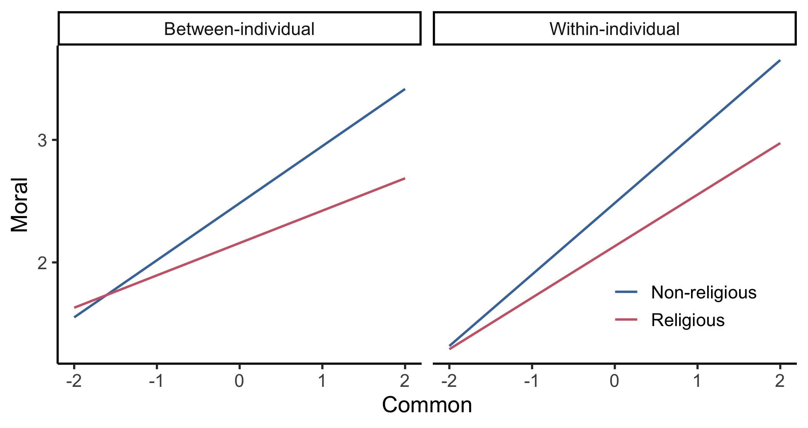
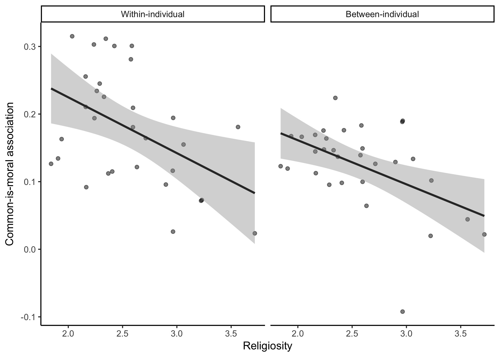

## Participants


```
## # A tibble: 1 x 5
##       n n_cntry female mean_age sd_age
##   <int>   <int>  <dbl>    <dbl>  <dbl>
## 1 37154      31  0.539     45.1   17.0
```


We use data on 37154 participants from 31 countries in the 1999 wave of the European Values Study, 54% women, mean age 45.1 with SD 17.0.


## Results


Table: Table 1. Descriptive statistics for perceptions of how common and how moral eight questionable behaviors are, including the correlation (the common-is-moral association).

|Behavior                           |Common M (SD) |Moral M (SD) |Pearson correlation |
|:----------------------------------|:-------------|:------------|:-------------------|
|Cheating on taxes                  |2.76 (0.52)   |2.59 (0.52)  |0.14 [0.13, 0.15]   |
|Claiming government benefits       |2.50 (0.52)   |2.21 (0.52)  |0.02 [0.01, 0.03]   |
|Driving under influence of alcohol |2.40 (0.43)   |1.50 (0.43)  |0.03 [0.02, 0.04]   |
|Having casual sex                  |2.50 (0.45)   |3.17 (0.45)  |0.19 [0.18, 0.20]   |
|Paying cash to avoid taxes         |2.69 (0.52)   |3.23 (0.52)  |0.16 [0.15, 0.17]   |
|Speeding over the limit            |2.74 (0.50)   |2.27 (0.50)  |0.15 [0.14, 0.16]   |
|Taking soft drugs                  |2.26 (0.44)   |1.85 (0.44)  |0.09 [0.08, 0.10]   |
|Throwing away litter               |2.72 (0.60)   |1.87 (0.60)  |0.07 [0.06, 0.08]   |


```
## # A tibble: 1 x 4
##   `min(r)` `max(r)` `mean(r)` `cor(r, just)`
##      <dbl>    <dbl>     <dbl>          <dbl>
## 1   0.0226    0.186     0.107          0.792
```

### The within-individual common-is-moral association is typically positive


| mean(r > 0)| mean(r)| sd(r)|
|-----------:|-------:|-----:|
|        0.65|    0.18|  0.41|


<div class="figure" style="text-align: center">

<p class="caption">Figure 1. Plot showing the average within-individual common-is-moral association in 31 countries in the European Values Study. Each dot represents a country. The box indicates the interquartile range, with the dark line in the box indicating the median.</p>
</div>


### The within-individual common-is-moral association is weaker among the more religious.

<div class="figure" style="text-align: center">

<p class="caption">Figure 2. The mean withinbetween-individual common-is-moral association (with 95% bootstrap confidence interval) in each of four subsamples defined by religiosity.</p>
</div>


<div class="figure" style="text-align: center">

<p class="caption">Figure 3. Fixed effect estimates, with 95% confidence intervals, from the three-level model of moral judgments with Co centered at the individual mean and the rest of the predictors centered at the country means.</p>
</div>


### The between-individual common-is-moral association is typically positive


```
## # A tibble: 8 x 3
##   behaviour   positive `mean(positive)`
##   <chr>          <dbl>            <dbl>
## 1 alc_drive      0.710            0.883
## 2 state_benef    0.742            0.883
## 3 liter          0.871            0.883
## 4 drugs          0.903            0.883
## 5 speed          0.935            0.883
## 6 tax_cheat      0.935            0.883
## 7 cash           0.968            0.883
## 8 casual_sex     1                0.883
```


<div class="figure" style="text-align: center">

<p class="caption">Figure 4. Boxplots showing how the common-is-moral association for eight questionable behaviors varied across 31 countries in the European Values Study. Boxes indicate the interquartile range, with the dark line in the box indicating the median. Below each box, the exact distribution is represented by dots.</p>
</div>

### The between-individual common-is-moral association is weaker among more religious people


<div class="figure" style="text-align: center">

<p class="caption">Figure 5. The between-individual common-is-moral association for each of eight behaviors in each of four subsamples defined by religiosity, averaged across countries. With 95% bootstrap CI.</p>
</div>


<div class="figure" style="text-align: center">

<p class="caption">Figure 6. Fixed effect estimates, with 95% confidence intervals, of the common-is-moral association (Co) and its moderation by religiosity (Co x Relig) using mixed-effect model M1. All predictors are centered at the country mean.</p>
</div>

<div class="figure" style="text-align: center">

<p class="caption">Figure 7. Religiosity moderates the common-is-moral association. The slope of the blue line represents the estimated common-is-moral association for an average behavior in the average country among non-religious individuals (1 scale unit lower than the average). The red line has less slope, representing the estimated common-is-moral association for an average behavior in the average country among religious individuals (1 scale unit lower than the average).</p>
</div>


### Country differences in religiosity partly explains country differences in the strength of the common-is-moral association


| mean(relig_cntry)| sd(relig_cntry)|
|-----------------:|---------------:|
|              2.56|            0.47|


```
## [1] 0.86
```


|type               | estimate| conf.low| conf.high|
|:------------------|--------:|--------:|---------:|
|Between-individual |    -0.49|    -0.72|     -0.17|
|Within-individual  |    -0.46|    -0.70|     -0.13|
<div class="figure" style="text-align: center">

<p class="caption">Figure 8. Country differences in religiosity partly explain country differences in the strength of the common-is-moral association, whether measured within individuals (left) or between individuals, averaged across behaviors (right).</p>
</div>


## Supplementary tables


<table class="table lightable-classic" style='width: auto !important; margin-left: auto; margin-right: auto; font-family: "Arial Narrow", "Source Sans Pro", sans-serif; margin-left: auto; margin-right: auto;'>
<caption>Supplementary Table 1. Estimates and 95% confidence intervals from different specifications of the three-level models.</caption>
 <thead>
  <tr>
   <th style="text-align:left;">   </th>
   <th style="text-align:left;"> M1. Baseline </th>
   <th style="text-align:left;"> M2.1. logit(p_Mo&gt;1) </th>
   <th style="text-align:left;"> M2.2. log(Mo)|Mo &gt; 1 </th>
  </tr>
 </thead>
<tbody>
  <tr>
   <td style="text-align:left;"> Co </td>
   <td style="text-align:left;"> 0.502 [0.404, 0.600] </td>
   <td style="text-align:left;"> 0.606 [0.495, 0.718] </td>
   <td style="text-align:left;"> 0.100 [0.084, 0.117] </td>
  </tr>
  <tr>
   <td style="text-align:left;"> Relig </td>
   <td style="text-align:left;"> -0.176 [-0.189, -0.163] </td>
   <td style="text-align:left;"> -0.211 [-0.229, -0.192] </td>
   <td style="text-align:left;"> -0.034 [-0.038, -0.029] </td>
  </tr>
  <tr>
   <td style="text-align:left;"> Co x Relig </td>
   <td style="text-align:left;"> -0.081 [-0.097, -0.066] </td>
   <td style="text-align:left;"> -0.012 [-0.031, 0.006] </td>
   <td style="text-align:left;"> -0.008 [-0.013, -0.003] </td>
  </tr>
  <tr>
   <td style="text-align:left;"> Female </td>
   <td style="text-align:left;"> -0.266 [-0.289, -0.243] </td>
   <td style="text-align:left;"> -0.411 [-0.446, -0.377] </td>
   <td style="text-align:left;"> -0.039 [-0.047, -0.031] </td>
  </tr>
  <tr>
   <td style="text-align:left;"> Age </td>
   <td style="text-align:left;"> -0.186 [-0.193, -0.179] </td>
   <td style="text-align:left;"> -0.282 [-0.293, -0.271] </td>
   <td style="text-align:left;"> -0.030 [-0.033, -0.028] </td>
  </tr>
  <tr>
   <td style="text-align:left;"> Education: Secondary </td>
   <td style="text-align:left;"> 0.022 [-0.006, 0.050] </td>
   <td style="text-align:left;"> 0.132 [0.089, 0.174] </td>
   <td style="text-align:left;"> -0.011 [-0.021, -0.001] </td>
  </tr>
  <tr>
   <td style="text-align:left;"> Education: Tertiary </td>
   <td style="text-align:left;"> 0.109 [0.075, 0.143] </td>
   <td style="text-align:left;"> 0.331 [0.280, 0.382] </td>
   <td style="text-align:left;"> -0.027 [-0.038, -0.015] </td>
  </tr>
  <tr>
   <td style="text-align:left;"> sigma(v1) </td>
   <td style="text-align:left;"> 0.922 </td>
   <td style="text-align:left;"> 1.367 </td>
   <td style="text-align:left;"> 0.252 </td>
  </tr>
  <tr>
   <td style="text-align:left;"> sigma(v2) </td>
   <td style="text-align:left;"> 0.697 </td>
   <td style="text-align:left;"> 0.358 </td>
   <td style="text-align:left;"> 0.125 </td>
  </tr>
  <tr>
   <td style="text-align:left;"> sigma(u1) </td>
   <td style="text-align:left;"> 0.445 </td>
   <td style="text-align:left;"> 0.781 </td>
   <td style="text-align:left;"> 0.077 </td>
  </tr>
  <tr>
   <td style="text-align:left;"> sigma(u2) </td>
   <td style="text-align:left;"> 0.276 </td>
   <td style="text-align:left;"> 0.313 </td>
   <td style="text-align:left;"> 0.044 </td>
  </tr>
  <tr>
   <td style="text-align:left;"> sigma(e) </td>
   <td style="text-align:left;"> 1.764 </td>
   <td style="text-align:left;">  </td>
   <td style="text-align:left;"> 0.416 </td>
  </tr>
  <tr>
   <td style="text-align:left;"> Nk </td>
   <td style="text-align:left;"> 277341 </td>
   <td style="text-align:left;"> 277341 </td>
   <td style="text-align:left;"> 110240 </td>
  </tr>
  <tr>
   <td style="text-align:left;"> Ni </td>
   <td style="text-align:left;"> 37154 </td>
   <td style="text-align:left;"> 37154 </td>
   <td style="text-align:left;"> 29706 </td>
  </tr>
  <tr>
   <td style="text-align:left;"> Nj </td>
   <td style="text-align:left;"> 31 </td>
   <td style="text-align:left;"> 31 </td>
   <td style="text-align:left;"> 31 </td>
  </tr>
</tbody>
</table>


<table class="table lightable-classic" style='width: auto !important; margin-left: auto; margin-right: auto; font-family: "Arial Narrow", "Source Sans Pro", sans-serif; margin-left: auto; margin-right: auto;'>
<caption>Supplementary Table 3. Estimates and 95% confidence intervals from different specifications of the mixed-effects models for "Cheating on taxes" behavior.</caption>
 <thead>
  <tr>
   <th style="text-align:left;">   </th>
   <th style="text-align:left;"> M1. Baseline </th>
   <th style="text-align:left;"> M2.1. logit(p_Mo&gt;1) </th>
   <th style="text-align:left;"> M2.2. log(Mo)|Mo &gt; 1 </th>
  </tr>
 </thead>
<tbody>
  <tr>
   <td style="text-align:left;"> Co </td>
   <td style="text-align:left;"> 0.498 [0.379, 0.616] </td>
   <td style="text-align:left;"> 0.350 [0.269, 0.431] </td>
   <td style="text-align:left;"> 0.111 [0.084, 0.139] </td>
  </tr>
  <tr>
   <td style="text-align:left;"> Relig </td>
   <td style="text-align:left;"> -0.179 [-0.204, -0.153] </td>
   <td style="text-align:left;"> -0.150 [-0.175, -0.125] </td>
   <td style="text-align:left;"> -0.033 [-0.042, -0.024] </td>
  </tr>
  <tr>
   <td style="text-align:left;"> Co x Relig </td>
   <td style="text-align:left;"> -0.128 [-0.163, -0.093] </td>
   <td style="text-align:left;"> -0.050 [-0.085, -0.015] </td>
   <td style="text-align:left;"> -0.016 [-0.027, -0.004] </td>
  </tr>
  <tr>
   <td style="text-align:left;"> Female </td>
   <td style="text-align:left;"> -0.249 [-0.296, -0.203] </td>
   <td style="text-align:left;"> -0.198 [-0.244, -0.153] </td>
   <td style="text-align:left;"> -0.055 [-0.071, -0.039] </td>
  </tr>
  <tr>
   <td style="text-align:left;"> Age </td>
   <td style="text-align:left;"> -0.209 [-0.223, -0.194] </td>
   <td style="text-align:left;"> -0.201 [-0.216, -0.186] </td>
   <td style="text-align:left;"> -0.032 [-0.037, -0.027] </td>
  </tr>
  <tr>
   <td style="text-align:left;"> Education: Secondary </td>
   <td style="text-align:left;"> -0.113 [-0.170, -0.056] </td>
   <td style="text-align:left;"> -0.005 [-0.061, 0.051] </td>
   <td style="text-align:left;"> -0.051 [-0.070, -0.031] </td>
  </tr>
  <tr>
   <td style="text-align:left;"> Education: Tertiary </td>
   <td style="text-align:left;"> -0.182 [-0.250, -0.114] </td>
   <td style="text-align:left;"> 0.020 [-0.046, 0.087] </td>
   <td style="text-align:left;"> -0.093 [-0.116, -0.069] </td>
  </tr>
  <tr>
   <td style="text-align:left;"> sigma(u1) </td>
   <td style="text-align:left;"> 0.659 </td>
   <td style="text-align:left;"> 0.643 </td>
   <td style="text-align:left;"> 0.132 </td>
  </tr>
  <tr>
   <td style="text-align:left;"> sigma(u2) </td>
   <td style="text-align:left;"> 0.320 </td>
   <td style="text-align:left;"> 0.204 </td>
   <td style="text-align:left;"> 0.070 </td>
  </tr>
  <tr>
   <td style="text-align:left;"> sigma(e) </td>
   <td style="text-align:left;"> 2.167 </td>
   <td style="text-align:left;">  </td>
   <td style="text-align:left;"> 0.491 </td>
  </tr>
  <tr>
   <td style="text-align:left;"> Ni </td>
   <td style="text-align:left;"> 34919 </td>
   <td style="text-align:left;"> 34919 </td>
   <td style="text-align:left;"> 15927 </td>
  </tr>
  <tr>
   <td style="text-align:left;"> Nj </td>
   <td style="text-align:left;"> 31 </td>
   <td style="text-align:left;"> 31 </td>
   <td style="text-align:left;"> 31 </td>
  </tr>
</tbody>
</table><table class="table lightable-classic" style='width: auto !important; margin-left: auto; margin-right: auto; font-family: "Arial Narrow", "Source Sans Pro", sans-serif; margin-left: auto; margin-right: auto;'>
<caption>Supplementary Table 3. Estimates and 95% confidence intervals from different specifications of the mixed-effects models for "Claiming government benefits" behavior.</caption>
 <thead>
  <tr>
   <th style="text-align:left;">   </th>
   <th style="text-align:left;"> M1. Baseline </th>
   <th style="text-align:left;"> M2.1. logit(p_Mo&gt;1) </th>
   <th style="text-align:left;"> M2.2. log(Mo)|Mo &gt; 1 </th>
  </tr>
 </thead>
<tbody>
  <tr>
   <td style="text-align:left;"> Co </td>
   <td style="text-align:left;"> 0.155 [0.077, 0.233] </td>
   <td style="text-align:left;"> 0.087 [0.007, 0.167] </td>
   <td style="text-align:left;"> 0.050 [0.029, 0.071] </td>
  </tr>
  <tr>
   <td style="text-align:left;"> Relig </td>
   <td style="text-align:left;"> -0.063 [-0.085, -0.041] </td>
   <td style="text-align:left;"> -0.079 [-0.104, -0.053] </td>
   <td style="text-align:left;"> -0.008 [-0.017, 0.001] </td>
  </tr>
  <tr>
   <td style="text-align:left;"> Co x Relig </td>
   <td style="text-align:left;"> -0.044 [-0.077, -0.012] </td>
   <td style="text-align:left;"> -0.005 [-0.043, 0.032] </td>
   <td style="text-align:left;"> -0.014 [-0.027, -0.001] </td>
  </tr>
  <tr>
   <td style="text-align:left;"> Female </td>
   <td style="text-align:left;"> -0.089 [-0.129, -0.049] </td>
   <td style="text-align:left;"> -0.110 [-0.157, -0.063] </td>
   <td style="text-align:left;"> -0.012 [-0.028, 0.005] </td>
  </tr>
  <tr>
   <td style="text-align:left;"> Age </td>
   <td style="text-align:left;"> -0.182 [-0.195, -0.169] </td>
   <td style="text-align:left;"> -0.226 [-0.241, -0.210] </td>
   <td style="text-align:left;"> -0.030 [-0.035, -0.025] </td>
  </tr>
  <tr>
   <td style="text-align:left;"> Education: Secondary </td>
   <td style="text-align:left;"> -0.190 [-0.239, -0.140] </td>
   <td style="text-align:left;"> -0.109 [-0.167, -0.052] </td>
   <td style="text-align:left;"> -0.075 [-0.096, -0.055] </td>
  </tr>
  <tr>
   <td style="text-align:left;"> Education: Tertiary </td>
   <td style="text-align:left;"> -0.268 [-0.327, -0.209] </td>
   <td style="text-align:left;"> -0.197 [-0.267, -0.128] </td>
   <td style="text-align:left;"> -0.103 [-0.128, -0.079] </td>
  </tr>
  <tr>
   <td style="text-align:left;"> sigma(u1) </td>
   <td style="text-align:left;"> 0.670 </td>
   <td style="text-align:left;"> 0.741 </td>
   <td style="text-align:left;"> 0.127 </td>
  </tr>
  <tr>
   <td style="text-align:left;"> sigma(u2) </td>
   <td style="text-align:left;"> 0.201 </td>
   <td style="text-align:left;"> 0.197 </td>
   <td style="text-align:left;"> 0.046 </td>
  </tr>
  <tr>
   <td style="text-align:left;"> sigma(e) </td>
   <td style="text-align:left;"> 1.872 </td>
   <td style="text-align:left;">  </td>
   <td style="text-align:left;"> 0.472 </td>
  </tr>
  <tr>
   <td style="text-align:left;"> Ni </td>
   <td style="text-align:left;"> 34318 </td>
   <td style="text-align:left;"> 34318 </td>
   <td style="text-align:left;"> 13731 </td>
  </tr>
  <tr>
   <td style="text-align:left;"> Nj </td>
   <td style="text-align:left;"> 31 </td>
   <td style="text-align:left;"> 31 </td>
   <td style="text-align:left;"> 31 </td>
  </tr>
</tbody>
</table><table class="table lightable-classic" style='width: auto !important; margin-left: auto; margin-right: auto; font-family: "Arial Narrow", "Source Sans Pro", sans-serif; margin-left: auto; margin-right: auto;'>
<caption>Supplementary Table 3. Estimates and 95% confidence intervals from different specifications of the mixed-effects models for "Driving under influence of alcohol" behavior.</caption>
 <thead>
  <tr>
   <th style="text-align:left;">   </th>
   <th style="text-align:left;"> M1. Baseline </th>
   <th style="text-align:left;"> M2.1. logit(p_Mo&gt;1) </th>
   <th style="text-align:left;"> M2.2. log(Mo)|Mo &gt; 1 </th>
  </tr>
 </thead>
<tbody>
  <tr>
   <td style="text-align:left;"> Co </td>
   <td style="text-align:left;"> 0.102 [0.060, 0.144] </td>
   <td style="text-align:left;"> 0.171 [0.108, 0.234] </td>
   <td style="text-align:left;"> 0.051 [0.021, 0.081] </td>
  </tr>
  <tr>
   <td style="text-align:left;"> Relig </td>
   <td style="text-align:left;"> -0.062 [-0.075, -0.048] </td>
   <td style="text-align:left;"> -0.128 [-0.157, -0.099] </td>
   <td style="text-align:left;"> -0.022 [-0.032, -0.011] </td>
  </tr>
  <tr>
   <td style="text-align:left;"> Co x Relig </td>
   <td style="text-align:left;"> -0.051 [-0.072, -0.030] </td>
   <td style="text-align:left;"> -0.040 [-0.085, 0.005] </td>
   <td style="text-align:left;"> -0.020 [-0.036, -0.004] </td>
  </tr>
  <tr>
   <td style="text-align:left;"> Female </td>
   <td style="text-align:left;"> -0.266 [-0.290, -0.241] </td>
   <td style="text-align:left;"> -0.660 [-0.713, -0.606] </td>
   <td style="text-align:left;"> -0.053 [-0.072, -0.034] </td>
  </tr>
  <tr>
   <td style="text-align:left;"> Age </td>
   <td style="text-align:left;"> -0.074 [-0.082, -0.067] </td>
   <td style="text-align:left;"> -0.186 [-0.203, -0.168] </td>
   <td style="text-align:left;"> -0.015 [-0.021, -0.009] </td>
  </tr>
  <tr>
   <td style="text-align:left;"> Education: Secondary </td>
   <td style="text-align:left;"> -0.015 [-0.045, 0.014] </td>
   <td style="text-align:left;"> 0.068 [0.001, 0.135] </td>
   <td style="text-align:left;"> -0.038 [-0.062, -0.014] </td>
  </tr>
  <tr>
   <td style="text-align:left;"> Education: Tertiary </td>
   <td style="text-align:left;"> 0.028 [-0.008, 0.064] </td>
   <td style="text-align:left;"> 0.258 [0.181, 0.336] </td>
   <td style="text-align:left;"> -0.061 [-0.089, -0.033] </td>
  </tr>
  <tr>
   <td style="text-align:left;"> sigma(u1) </td>
   <td style="text-align:left;"> 0.259 </td>
   <td style="text-align:left;"> 0.665 </td>
   <td style="text-align:left;"> 0.071 </td>
  </tr>
  <tr>
   <td style="text-align:left;"> sigma(u2) </td>
   <td style="text-align:left;"> 0.105 </td>
   <td style="text-align:left;"> 0.114 </td>
   <td style="text-align:left;"> 0.070 </td>
  </tr>
  <tr>
   <td style="text-align:left;"> sigma(e) </td>
   <td style="text-align:left;"> 1.166 </td>
   <td style="text-align:left;">  </td>
   <td style="text-align:left;"> 0.418 </td>
  </tr>
  <tr>
   <td style="text-align:left;"> Ni </td>
   <td style="text-align:left;"> 36242 </td>
   <td style="text-align:left;"> 36242 </td>
   <td style="text-align:left;"> 7998 </td>
  </tr>
  <tr>
   <td style="text-align:left;"> Nj </td>
   <td style="text-align:left;"> 31 </td>
   <td style="text-align:left;"> 31 </td>
   <td style="text-align:left;"> 31 </td>
  </tr>
</tbody>
</table><table class="table lightable-classic" style='width: auto !important; margin-left: auto; margin-right: auto; font-family: "Arial Narrow", "Source Sans Pro", sans-serif; margin-left: auto; margin-right: auto;'>
<caption>Supplementary Table 3. Estimates and 95% confidence intervals from different specifications of the mixed-effects models for "Having casual sex" behavior.</caption>
 <thead>
  <tr>
   <th style="text-align:left;">   </th>
   <th style="text-align:left;"> M1. Baseline </th>
   <th style="text-align:left;"> M2.1. logit(p_Mo&gt;1) </th>
   <th style="text-align:left;"> M2.2. log(Mo)|Mo &gt; 1 </th>
  </tr>
 </thead>
<tbody>
  <tr>
   <td style="text-align:left;"> Co </td>
   <td style="text-align:left;"> 0.743 [0.611, 0.875] </td>
   <td style="text-align:left;"> 0.425 [0.347, 0.503] </td>
   <td style="text-align:left;"> 0.146 [0.126, 0.167] </td>
  </tr>
  <tr>
   <td style="text-align:left;"> Relig </td>
   <td style="text-align:left;"> -0.408 [-0.436, -0.380] </td>
   <td style="text-align:left;"> -0.361 [-0.388, -0.334] </td>
   <td style="text-align:left;"> -0.052 [-0.060, -0.044] </td>
  </tr>
  <tr>
   <td style="text-align:left;"> Co x Relig </td>
   <td style="text-align:left;"> -0.224 [-0.267, -0.181] </td>
   <td style="text-align:left;"> -0.085 [-0.129, -0.041] </td>
   <td style="text-align:left;"> -0.022 [-0.034, -0.010] </td>
  </tr>
  <tr>
   <td style="text-align:left;"> Female </td>
   <td style="text-align:left;"> -0.580 [-0.631, -0.529] </td>
   <td style="text-align:left;"> -0.528 [-0.578, -0.478] </td>
   <td style="text-align:left;"> -0.082 [-0.096, -0.068] </td>
  </tr>
  <tr>
   <td style="text-align:left;"> Age </td>
   <td style="text-align:left;"> -0.294 [-0.310, -0.277] </td>
   <td style="text-align:left;"> -0.261 [-0.277, -0.245] </td>
   <td style="text-align:left;"> -0.043 [-0.048, -0.039] </td>
  </tr>
  <tr>
   <td style="text-align:left;"> Education: Secondary </td>
   <td style="text-align:left;"> 0.284 [0.221, 0.346] </td>
   <td style="text-align:left;"> 0.313 [0.253, 0.374] </td>
   <td style="text-align:left;"> 0.025 [0.007, 0.043] </td>
  </tr>
  <tr>
   <td style="text-align:left;"> Education: Tertiary </td>
   <td style="text-align:left;"> 0.614 [0.539, 0.689] </td>
   <td style="text-align:left;"> 0.645 [0.572, 0.718] </td>
   <td style="text-align:left;"> 0.047 [0.026, 0.067] </td>
  </tr>
  <tr>
   <td style="text-align:left;"> sigma(u1) </td>
   <td style="text-align:left;"> 0.876 </td>
   <td style="text-align:left;"> 0.872 </td>
   <td style="text-align:left;"> 0.143 </td>
  </tr>
  <tr>
   <td style="text-align:left;"> sigma(u2) </td>
   <td style="text-align:left;"> 0.355 </td>
   <td style="text-align:left;"> 0.183 </td>
   <td style="text-align:left;"> 0.046 </td>
  </tr>
  <tr>
   <td style="text-align:left;"> sigma(e) </td>
   <td style="text-align:left;"> 2.318 </td>
   <td style="text-align:left;">  </td>
   <td style="text-align:left;"> 0.472 </td>
  </tr>
  <tr>
   <td style="text-align:left;"> Ni </td>
   <td style="text-align:left;"> 32799 </td>
   <td style="text-align:left;"> 32799 </td>
   <td style="text-align:left;"> 17730 </td>
  </tr>
  <tr>
   <td style="text-align:left;"> Nj </td>
   <td style="text-align:left;"> 31 </td>
   <td style="text-align:left;"> 31 </td>
   <td style="text-align:left;"> 31 </td>
  </tr>
</tbody>
</table><table class="table lightable-classic" style='width: auto !important; margin-left: auto; margin-right: auto; font-family: "Arial Narrow", "Source Sans Pro", sans-serif; margin-left: auto; margin-right: auto;'>
<caption>Supplementary Table 3. Estimates and 95% confidence intervals from different specifications of the mixed-effects models for "Taking soft drugs" behavior.</caption>
 <thead>
  <tr>
   <th style="text-align:left;">   </th>
   <th style="text-align:left;"> M1. Baseline </th>
   <th style="text-align:left;"> M2.1. logit(p_Mo&gt;1) </th>
   <th style="text-align:left;"> M2.2. log(Mo)|Mo &gt; 1 </th>
  </tr>
 </thead>
<tbody>
  <tr>
   <td style="text-align:left;"> Co </td>
   <td style="text-align:left;"> 0.304 [0.196, 0.412] </td>
   <td style="text-align:left;"> 0.211 [0.114, 0.308] </td>
   <td style="text-align:left;"> 0.111 [0.078, 0.144] </td>
  </tr>
  <tr>
   <td style="text-align:left;"> Relig </td>
   <td style="text-align:left;"> -0.207 [-0.227, -0.188] </td>
   <td style="text-align:left;"> -0.290 [-0.321, -0.260] </td>
   <td style="text-align:left;"> -0.051 [-0.063, -0.040] </td>
  </tr>
  <tr>
   <td style="text-align:left;"> Co x Relig </td>
   <td style="text-align:left;"> -0.152 [-0.183, -0.121] </td>
   <td style="text-align:left;"> -0.062 [-0.111, -0.013] </td>
   <td style="text-align:left;"> -0.025 [-0.042, -0.007] </td>
  </tr>
  <tr>
   <td style="text-align:left;"> Female </td>
   <td style="text-align:left;"> -0.228 [-0.264, -0.191] </td>
   <td style="text-align:left;"> -0.354 [-0.410, -0.298] </td>
   <td style="text-align:left;"> -0.060 [-0.081, -0.039] </td>
  </tr>
  <tr>
   <td style="text-align:left;"> Age </td>
   <td style="text-align:left;"> -0.195 [-0.207, -0.184] </td>
   <td style="text-align:left;"> -0.350 [-0.369, -0.330] </td>
   <td style="text-align:left;"> -0.046 [-0.054, -0.039] </td>
  </tr>
  <tr>
   <td style="text-align:left;"> Education: Secondary </td>
   <td style="text-align:left;"> 0.186 [0.141, 0.230] </td>
   <td style="text-align:left;"> 0.330 [0.260, 0.401] </td>
   <td style="text-align:left;"> 0.038 [0.010, 0.065] </td>
  </tr>
  <tr>
   <td style="text-align:left;"> Education: Tertiary </td>
   <td style="text-align:left;"> 0.493 [0.440, 0.547] </td>
   <td style="text-align:left;"> 0.806 [0.726, 0.885] </td>
   <td style="text-align:left;"> 0.070 [0.040, 0.100] </td>
  </tr>
  <tr>
   <td style="text-align:left;"> sigma(u1) </td>
   <td style="text-align:left;"> 0.570 </td>
   <td style="text-align:left;"> 0.914 </td>
   <td style="text-align:left;"> 0.138 </td>
  </tr>
  <tr>
   <td style="text-align:left;"> sigma(u2) </td>
   <td style="text-align:left;"> 0.294 </td>
   <td style="text-align:left;"> 0.230 </td>
   <td style="text-align:left;"> 0.074 </td>
  </tr>
  <tr>
   <td style="text-align:left;"> sigma(e) </td>
   <td style="text-align:left;"> 1.667 </td>
   <td style="text-align:left;">  </td>
   <td style="text-align:left;"> 0.479 </td>
  </tr>
  <tr>
   <td style="text-align:left;"> Ni </td>
   <td style="text-align:left;"> 33616 </td>
   <td style="text-align:left;"> 33616 </td>
   <td style="text-align:left;"> 8272 </td>
  </tr>
  <tr>
   <td style="text-align:left;"> Nj </td>
   <td style="text-align:left;"> 31 </td>
   <td style="text-align:left;"> 31 </td>
   <td style="text-align:left;"> 31 </td>
  </tr>
</tbody>
</table><table class="table lightable-classic" style='width: auto !important; margin-left: auto; margin-right: auto; font-family: "Arial Narrow", "Source Sans Pro", sans-serif; margin-left: auto; margin-right: auto;'>
<caption>Supplementary Table 3. Estimates and 95% confidence intervals from different specifications of the mixed-effects models for "Speeding over the limit" behavior.</caption>
 <thead>
  <tr>
   <th style="text-align:left;">   </th>
   <th style="text-align:left;"> M1. Baseline </th>
   <th style="text-align:left;"> M2.1. logit(p_Mo&gt;1) </th>
   <th style="text-align:left;"> M2.2. log(Mo)|Mo &gt; 1 </th>
  </tr>
 </thead>
<tbody>
  <tr>
   <td style="text-align:left;"> Co </td>
   <td style="text-align:left;"> 0.353 [0.260, 0.447] </td>
   <td style="text-align:left;"> 0.273 [0.184, 0.361] </td>
   <td style="text-align:left;"> 0.095 [0.069, 0.120] </td>
  </tr>
  <tr>
   <td style="text-align:left;"> Relig </td>
   <td style="text-align:left;"> -0.137 [-0.157, -0.117] </td>
   <td style="text-align:left;"> -0.134 [-0.159, -0.109] </td>
   <td style="text-align:left;"> -0.029 [-0.037, -0.021] </td>
  </tr>
  <tr>
   <td style="text-align:left;"> Co x Relig </td>
   <td style="text-align:left;"> -0.106 [-0.135, -0.078] </td>
   <td style="text-align:left;"> -0.043 [-0.080, -0.007] </td>
   <td style="text-align:left;"> -0.014 [-0.025, -0.003] </td>
  </tr>
  <tr>
   <td style="text-align:left;"> Female </td>
   <td style="text-align:left;"> -0.362 [-0.399, -0.325] </td>
   <td style="text-align:left;"> -0.451 [-0.498, -0.405] </td>
   <td style="text-align:left;"> -0.061 [-0.075, -0.047] </td>
  </tr>
  <tr>
   <td style="text-align:left;"> Age </td>
   <td style="text-align:left;"> -0.187 [-0.199, -0.176] </td>
   <td style="text-align:left;"> -0.236 [-0.251, -0.221] </td>
   <td style="text-align:left;"> -0.031 [-0.036, -0.026] </td>
  </tr>
  <tr>
   <td style="text-align:left;"> Education: Secondary </td>
   <td style="text-align:left;"> 0.092 [0.047, 0.137] </td>
   <td style="text-align:left;"> 0.195 [0.139, 0.252] </td>
   <td style="text-align:left;"> 0.004 [-0.014, 0.022] </td>
  </tr>
  <tr>
   <td style="text-align:left;"> Education: Tertiary </td>
   <td style="text-align:left;"> 0.282 [0.227, 0.336] </td>
   <td style="text-align:left;"> 0.514 [0.446, 0.581] </td>
   <td style="text-align:left;"> 0.002 [-0.019, 0.022] </td>
  </tr>
  <tr>
   <td style="text-align:left;"> sigma(u1) </td>
   <td style="text-align:left;"> 0.599 </td>
   <td style="text-align:left;"> 0.804 </td>
   <td style="text-align:left;"> 0.112 </td>
  </tr>
  <tr>
   <td style="text-align:left;"> sigma(u2) </td>
   <td style="text-align:left;"> 0.254 </td>
   <td style="text-align:left;"> 0.227 </td>
   <td style="text-align:left;"> 0.064 </td>
  </tr>
  <tr>
   <td style="text-align:left;"> sigma(e) </td>
   <td style="text-align:left;"> 1.751 </td>
   <td style="text-align:left;">  </td>
   <td style="text-align:left;"> 0.445 </td>
  </tr>
  <tr>
   <td style="text-align:left;"> Ni </td>
   <td style="text-align:left;"> 36075 </td>
   <td style="text-align:left;"> 36075 </td>
   <td style="text-align:left;"> 15785 </td>
  </tr>
  <tr>
   <td style="text-align:left;"> Nj </td>
   <td style="text-align:left;"> 31 </td>
   <td style="text-align:left;"> 31 </td>
   <td style="text-align:left;"> 31 </td>
  </tr>
</tbody>
</table><table class="table lightable-classic" style='width: auto !important; margin-left: auto; margin-right: auto; font-family: "Arial Narrow", "Source Sans Pro", sans-serif; margin-left: auto; margin-right: auto;'>
<caption>Supplementary Table 3. Estimates and 95% confidence intervals from different specifications of the mixed-effects models for "Taking soft drugs" behavior.</caption>
 <thead>
  <tr>
   <th style="text-align:left;">   </th>
   <th style="text-align:left;"> M1. Baseline </th>
   <th style="text-align:left;"> M2.1. logit(p_Mo&gt;1) </th>
   <th style="text-align:left;"> M2.2. log(Mo)|Mo &gt; 1 </th>
  </tr>
 </thead>
<tbody>
  <tr>
   <td style="text-align:left;"> Co </td>
   <td style="text-align:left;"> 0.304 [0.196, 0.412] </td>
   <td style="text-align:left;"> 0.211 [0.114, 0.308] </td>
   <td style="text-align:left;"> 0.111 [0.078, 0.144] </td>
  </tr>
  <tr>
   <td style="text-align:left;"> Relig </td>
   <td style="text-align:left;"> -0.207 [-0.227, -0.188] </td>
   <td style="text-align:left;"> -0.290 [-0.321, -0.260] </td>
   <td style="text-align:left;"> -0.051 [-0.063, -0.040] </td>
  </tr>
  <tr>
   <td style="text-align:left;"> Co x Relig </td>
   <td style="text-align:left;"> -0.152 [-0.183, -0.121] </td>
   <td style="text-align:left;"> -0.062 [-0.111, -0.013] </td>
   <td style="text-align:left;"> -0.025 [-0.042, -0.007] </td>
  </tr>
  <tr>
   <td style="text-align:left;"> Female </td>
   <td style="text-align:left;"> -0.228 [-0.264, -0.191] </td>
   <td style="text-align:left;"> -0.354 [-0.410, -0.298] </td>
   <td style="text-align:left;"> -0.060 [-0.081, -0.039] </td>
  </tr>
  <tr>
   <td style="text-align:left;"> Age </td>
   <td style="text-align:left;"> -0.195 [-0.207, -0.184] </td>
   <td style="text-align:left;"> -0.350 [-0.369, -0.330] </td>
   <td style="text-align:left;"> -0.046 [-0.054, -0.039] </td>
  </tr>
  <tr>
   <td style="text-align:left;"> Education: Secondary </td>
   <td style="text-align:left;"> 0.186 [0.141, 0.230] </td>
   <td style="text-align:left;"> 0.330 [0.260, 0.401] </td>
   <td style="text-align:left;"> 0.038 [0.010, 0.065] </td>
  </tr>
  <tr>
   <td style="text-align:left;"> Education: Tertiary </td>
   <td style="text-align:left;"> 0.493 [0.440, 0.547] </td>
   <td style="text-align:left;"> 0.806 [0.726, 0.885] </td>
   <td style="text-align:left;"> 0.070 [0.040, 0.100] </td>
  </tr>
  <tr>
   <td style="text-align:left;"> sigma(u1) </td>
   <td style="text-align:left;"> 0.570 </td>
   <td style="text-align:left;"> 0.914 </td>
   <td style="text-align:left;"> 0.138 </td>
  </tr>
  <tr>
   <td style="text-align:left;"> sigma(u2) </td>
   <td style="text-align:left;"> 0.294 </td>
   <td style="text-align:left;"> 0.230 </td>
   <td style="text-align:left;"> 0.074 </td>
  </tr>
  <tr>
   <td style="text-align:left;"> sigma(e) </td>
   <td style="text-align:left;"> 1.667 </td>
   <td style="text-align:left;">  </td>
   <td style="text-align:left;"> 0.479 </td>
  </tr>
  <tr>
   <td style="text-align:left;"> Ni </td>
   <td style="text-align:left;"> 33616 </td>
   <td style="text-align:left;"> 33616 </td>
   <td style="text-align:left;"> 8272 </td>
  </tr>
  <tr>
   <td style="text-align:left;"> Nj </td>
   <td style="text-align:left;"> 31 </td>
   <td style="text-align:left;"> 31 </td>
   <td style="text-align:left;"> 31 </td>
  </tr>
</tbody>
</table><table class="table lightable-classic" style='width: auto !important; margin-left: auto; margin-right: auto; font-family: "Arial Narrow", "Source Sans Pro", sans-serif; margin-left: auto; margin-right: auto;'>
<caption>Supplementary Table 3. Estimates and 95% confidence intervals from different specifications of the mixed-effects models for "Throwing away litter" behavior.</caption>
 <thead>
  <tr>
   <th style="text-align:left;">   </th>
   <th style="text-align:left;"> M1. Baseline </th>
   <th style="text-align:left;"> M2.1. logit(p_Mo&gt;1) </th>
   <th style="text-align:left;"> M2.2. log(Mo)|Mo &gt; 1 </th>
  </tr>
 </thead>
<tbody>
  <tr>
   <td style="text-align:left;"> Co </td>
   <td style="text-align:left;"> 0.131 [0.068, 0.194] </td>
   <td style="text-align:left;"> 0.110 [0.050, 0.170] </td>
   <td style="text-align:left;"> 0.045 [0.024, 0.066] </td>
  </tr>
  <tr>
   <td style="text-align:left;"> Relig </td>
   <td style="text-align:left;"> -0.039 [-0.056, -0.021] </td>
   <td style="text-align:left;"> -0.055 [-0.081, -0.029] </td>
   <td style="text-align:left;"> -0.008 [-0.017, 0.001] </td>
  </tr>
  <tr>
   <td style="text-align:left;"> Co x Relig </td>
   <td style="text-align:left;"> -0.025 [-0.049, -0.002] </td>
   <td style="text-align:left;"> -0.000 [-0.034, 0.034] </td>
   <td style="text-align:left;"> -0.012 [-0.023, 0.000] </td>
  </tr>
  <tr>
   <td style="text-align:left;"> Female </td>
   <td style="text-align:left;"> -0.147 [-0.179, -0.115] </td>
   <td style="text-align:left;"> -0.238 [-0.285, -0.190] </td>
   <td style="text-align:left;"> -0.024 [-0.041, -0.008] </td>
  </tr>
  <tr>
   <td style="text-align:left;"> Age </td>
   <td style="text-align:left;"> -0.116 [-0.126, -0.105] </td>
   <td style="text-align:left;"> -0.179 [-0.195, -0.164] </td>
   <td style="text-align:left;"> -0.020 [-0.026, -0.015] </td>
  </tr>
  <tr>
   <td style="text-align:left;"> Education: Secondary </td>
   <td style="text-align:left;"> -0.049 [-0.088, -0.009] </td>
   <td style="text-align:left;"> -0.037 [-0.095, 0.022] </td>
   <td style="text-align:left;"> -0.023 [-0.044, -0.003] </td>
  </tr>
  <tr>
   <td style="text-align:left;"> Education: Tertiary </td>
   <td style="text-align:left;"> -0.091 [-0.139, -0.044] </td>
   <td style="text-align:left;"> 0.003 [-0.067, 0.073] </td>
   <td style="text-align:left;"> -0.061 [-0.085, -0.037] </td>
  </tr>
  <tr>
   <td style="text-align:left;"> sigma(u1) </td>
   <td style="text-align:left;"> 0.478 </td>
   <td style="text-align:left;"> 0.751 </td>
   <td style="text-align:left;"> 0.104 </td>
  </tr>
  <tr>
   <td style="text-align:left;"> sigma(u2) </td>
   <td style="text-align:left;"> 0.167 </td>
   <td style="text-align:left;"> 0.136 </td>
   <td style="text-align:left;"> 0.049 </td>
  </tr>
  <tr>
   <td style="text-align:left;"> sigma(e) </td>
   <td style="text-align:left;"> 1.531 </td>
   <td style="text-align:left;">  </td>
   <td style="text-align:left;"> 0.440 </td>
  </tr>
  <tr>
   <td style="text-align:left;"> Ni </td>
   <td style="text-align:left;"> 36203 </td>
   <td style="text-align:left;"> 36203 </td>
   <td style="text-align:left;"> 11531 </td>
  </tr>
  <tr>
   <td style="text-align:left;"> Nj </td>
   <td style="text-align:left;"> 31 </td>
   <td style="text-align:left;"> 31 </td>
   <td style="text-align:left;"> 31 </td>
  </tr>
</tbody>
</table>

