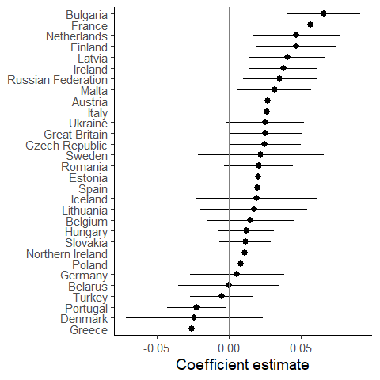
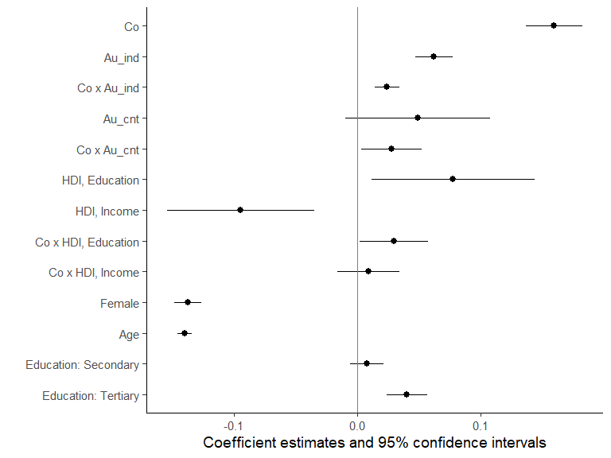
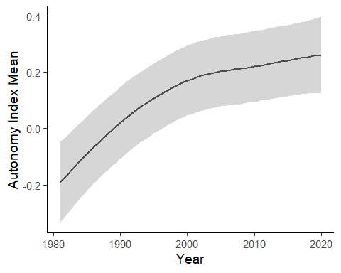

## Participants

We use data on 35512 participants from 30 countries in the 1999 wave of the European Values Study, 54% women, mean age 45.3 with SD 17.1.

## Results

*Table 1:* Descriptive statistics for perceptions of how common and how moral eight questionable behaviors are, including the correlation (the common-is-moral association).

Table: Table 1: Descriptive statistics for perceptions of how common and how moral eight questionable behaviors are, and the common-is-moral association.

|Behavior                           |Common M (SD) |Moral M (SD) |Pearson correlation |
|:----------------------------------|:-------------|:------------|:-------------------|
|Cheating on taxes                  |2.76 (0.53)   |2.59 (0.53)  |0.14 [0.13, 0.15]   |
|Claiming government benefits       |2.50 (0.52)   |2.23 (0.52)  |0.02 [0.01, 0.03]   |
|Driving under influence of alcohol |2.39 (0.43)   |1.50 (0.43)  |0.03 [0.02, 0.04]   |
|Having casual sex                  |2.50 (0.45)   |3.18 (0.45)  |0.19 [0.18, 0.20]   |
|Paying cash to avoid taxes         |2.70 (0.52)   |3.24 (0.52)  |0.15 [0.14, 0.16]   |
|Speeding over the limit            |2.74 (0.50)   |2.29 (0.50)  |0.15 [0.14, 0.16]   |
|Taking soft drugs                  |2.25 (0.43)   |1.84 (0.43)  |0.08 [0.07, 0.09]   |
|Throwing away litter               |2.72 (0.60)   |1.88 (0.60)  |0.07 [0.06, 0.08]   |

### Near universality of the common-is-moral association

### The common-is-moral association is stronger in countries where the autonomy index is higher

By averaging the autonomy index over all respondents in a country we obtained a country-level autonomy index, ranging from -0.64 (Turkey) to 0.93 (Germany). Next we examined whether the country variation in the common-is-moral association is accounted for by variation in the country-level autonomy index. Figure 2 presents eight scatter plots, one for each questionable behavior, all showing a stronger common-is-moral association in countries with higher autonomy index. Regression line slopes ranged from B = 0.04, 95% CI [-0.01, 0.10] to 0.12, 95% CI [0.04, 0.21]. The proportion of variance explained ranged from R2 = 0.08 to  R2 = 0.24.

### Within countries, the common-is-moral association is stronger among people with higher autonomy index

## Mixed-effects models

![Figure 5. Autonomy values moderate the common-is-moral association. The slope of the blue line (ß2 in the model) represents the estimated common-is-moral association among average individuals in the average country. The additional slope of the yellow line  (ß4)  represents the increase in the common-is-moral association when estimated among individuals who are one standard deviation higher on the autonomy index. The additional slope of the red line (ß6) represents the estimated further increase in the common-is-moral association when also the country is one standard deviation higher on the autonomy index.](manuscript-results_files/figure-html/fig5-1.png)

## The development of the autonomy index over time

## Supplementary tables

Table: Supplementary Table 1. Fit measures for measurement invariance tests.

|Model                          | Chisq|  DF|  CFI|  NCI| RMSEA| <U+0001D6AB>CFI| <U+0001D6AB>NCI| <U+0001D6AB>RMSEA|
|:------------------------------|-----:|---:|----:|----:|-----:|---------------:|---------------:|-----------------:|
|Model 1. Pooled sample         |  1386|   2| 0.85| 0.98|  0.14|              NA|              NA|                NA|
|Model 2. Configural invariance |  1073|  60| 0.87| 0.99|  0.12|           0.019|           0.005|            -0.020|
|Model 3. Metric invariance     |  1602| 147| 0.81| 0.98|  0.09|          -0.057|          -0.006|            -0.028|
|Model 4. Scalar invariance     |  3256| 118| 0.60| 0.96|  0.15|          -0.216|          -0.023|             0.058|

Table: Supplementary Table 2. Country estimates of the common-is-moral association for eight questionable behaviors, and the country-mean autonomy index.

|Country            | state_benef| tax_cheat|  cash| drugs| liter| speed| alc_drive| casual_sex| Au_cnt|
|:------------------|-----------:|---------:|-----:|-----:|-----:|-----:|---------:|----------:|------:|
|Austria            |        0.06|      0.23|  0.30|  0.15|  0.14|  0.09|      0.06|       0.14|   0.71|
|Belarus            |       -0.02|      0.25|  0.27|  0.09|  0.01|  0.19|      0.10|       0.26|   0.39|
|Belgium            |        0.16|      0.30|  0.27|  0.11|  0.02|  0.22|      0.12|       0.19|   0.29|
|Bulgaria           |        0.06|      0.13|  0.08|  0.05|  0.07|  0.12|      0.08|       0.23|   0.72|
|Czech Republic     |        0.05|      0.18|  0.14|  0.07|  0.07|  0.18|      0.05|       0.21|   0.74|
|Denmark            |       -0.02|      0.23|  0.33|  0.12|  0.09|  0.30|      0.04|       0.21|   0.93|
|Estonia            |        0.10|      0.16|  0.16|  0.08|  0.06|  0.08|      0.02|       0.24|   0.38|
|Finland            |        0.15|      0.29|  0.30|  0.20|  0.16|  0.23|      0.20|       0.34|   0.62|
|France             |        0.11|      0.20|  0.21|  0.14| -0.03|  0.15|      0.00|       0.10|   0.25|
|Germany            |        0.27|      0.26|  0.25|  0.15|  0.12|  0.04|      0.04|       0.21|   0.92|
|Great Britain      |        0.03|      0.22|  0.17|  0.13|  0.17|  0.15|      0.09|       0.13|   0.19|
|Greece             |        0.07|      0.10|  0.12|  0.29|  0.09|  0.10|      0.04|       0.25|   0.63|
|Hungary            |        0.09|      0.10|  0.16|  0.07|  0.00|  0.12|      0.06|       0.16|   0.52|
|Iceland            |        0.03|      0.16|  0.24|  0.08|  0.26|  0.34|     -0.01|       0.36|   0.79|
|Ireland            |        0.05|      0.22|  0.25|  0.07|  0.00|  0.18|      0.01|       0.21|  -0.09|
|Italy              |        0.04|      0.19|  0.27|  0.18|  0.11|  0.33|      0.14|       0.28|   0.16|
|Latvia             |        0.07|      0.08|  0.23|  0.17|  0.16|  0.22|      0.15|       0.29|   0.57|
|Lithuania          |        0.14|      0.14|  0.22|  0.02|  0.08|  0.20|      0.06|       0.21|   0.73|
|Malta              |       -0.03|      0.21|  0.09| -0.02| -0.07|  0.02|      0.05|       0.06|  -0.50|
|Netherlands        |        0.00|      0.31|  0.25|  0.13|  0.14|  0.19|      0.07|       0.22|   0.53|
|Northern Ireland   |        0.08|      0.10|  0.24|  0.23|  0.10|  0.05|     -0.06|       0.32|  -0.15|
|Poland             |        0.07|      0.15|  0.13|  0.03| -0.02|  0.19|      0.00|       0.26|  -0.16|
|Portugal           |       -0.10|     -0.07| -0.17| -0.15| -0.14| -0.05|     -0.06|       0.01|  -0.15|
|Romania            |       -0.04|     -0.06|  0.09| -0.03|  0.05|  0.08|     -0.01|       0.06|  -0.24|
|Russian Federation |        0.05|      0.18|  0.21|  0.08|  0.02|  0.14|      0.11|       0.31|   0.32|
|Slovakia           |        0.04|      0.06|  0.04|  0.07|  0.04|  0.15|      0.01|       0.12|   0.29|
|Spain              |        0.02|      0.11|  0.29|  0.29|  0.03|  0.05|      0.13|       0.30|  -0.01|
|Sweden             |        0.06|      0.28|  0.29|  0.01|  0.19|  0.24|     -0.02|       0.36|   0.80|
|Turkey             |        0.00|      0.03|  0.00|  0.03|  0.08| -0.02|     -0.02|       0.08|  -0.64|
|Ukraine            |        0.01|      0.20|  0.15|  0.03|  0.04|  0.15|      0.08|       0.22|   0.32|

<table class="table" style="width: auto !important; margin-left: auto; margin-right: auto;">
<caption>Supplementary Table 3. Results from different specifications of the mixed-effects model.</caption>
 <thead>
  <tr>
   <th style="text-align:left;">   </th>
   <th style="text-align:left;"> M1. Baseline </th>
   <th style="text-align:left;"> M2.1. Part 1, logit(if y &gt; 1) </th>
   <th style="text-align:left;"> M2.2. Part 2, log(y)|y &gt; 1 </th>
   <th style="text-align:left;"> M3. Two items autonomy </th>
   <th style="text-align:left;"> M4. Style factor </th>
  </tr>
 </thead>
<tbody>
  <tr>
   <td style="text-align:left;"> Intercept </td>
   <td style="text-align:left;"> 0.073 (1.778) </td>
   <td style="text-align:left;"> -0.512 (-3.961) </td>
   <td style="text-align:left;"> 0.011 (0.330) </td>
   <td style="text-align:left;"> 0.074 (1.746) </td>
   <td style="text-align:left;"> 0.005 (0.554) </td>
  </tr>
  <tr>
   <td style="text-align:left;"> Co </td>
   <td style="text-align:left;"> 0.160 (13.608) </td>
   <td style="text-align:left;"> 0.411 (14.103) </td>
   <td style="text-align:left;"> 0.137 (14.707) </td>
   <td style="text-align:left;"> 0.161 (13.040) </td>
   <td style="text-align:left;"> 0.122 (13.556) </td>
  </tr>
  <tr>
   <td style="text-align:left;"> Au_ind </td>
   <td style="text-align:left;"> 0.062 (8.040) </td>
   <td style="text-align:left;"> 0.180 (9.938) </td>
   <td style="text-align:left;"> 0.037 (5.836) </td>
   <td style="text-align:left;"> 0.043 (5.896) </td>
   <td style="text-align:left;"> -0.001 (-0.224) </td>
  </tr>
  <tr>
   <td style="text-align:left;"> Co x Au_ind </td>
   <td style="text-align:left;"> 0.024 (4.813) </td>
   <td style="text-align:left;"> 0.028 (2.059) </td>
   <td style="text-align:left;"> 0.013 (2.645) </td>
   <td style="text-align:left;"> 0.014 (3.177) </td>
   <td style="text-align:left;"> 0.017 (4.733) </td>
  </tr>
  <tr>
   <td style="text-align:left;"> Au_cnt </td>
   <td style="text-align:left;"> 0.049 (1.631) </td>
   <td style="text-align:left;"> 0.293 (2.352) </td>
   <td style="text-align:left;"> -0.025 (-0.725) </td>
   <td style="text-align:left;"> 0.053 (1.648) </td>
   <td style="text-align:left;"> 0.004 (0.523) </td>
  </tr>
  <tr>
   <td style="text-align:left;"> Co x Au_cnt </td>
   <td style="text-align:left;"> 0.028 (2.202) </td>
   <td style="text-align:left;"> 0.084 (2.813) </td>
   <td style="text-align:left;"> 0.015 (1.411) </td>
   <td style="text-align:left;"> 0.027 (2.096) </td>
   <td style="text-align:left;"> 0.021 (2.163) </td>
  </tr>
  <tr>
   <td style="text-align:left;"> HDI, Education </td>
   <td style="text-align:left;"> 0.078 (2.298) </td>
   <td style="text-align:left;"> 0.381 (2.574) </td>
   <td style="text-align:left;"> 0.078 (1.944) </td>
   <td style="text-align:left;"> 0.097 (2.802) </td>
   <td style="text-align:left;"> 0.008 (0.972) </td>
  </tr>
  <tr>
   <td style="text-align:left;"> HDI, Income </td>
   <td style="text-align:left;"> -0.095 (-3.105) </td>
   <td style="text-align:left;"> -0.275 (-1.828) </td>
   <td style="text-align:left;"> -0.046 (-1.301) </td>
   <td style="text-align:left;"> -0.093 (-2.775) </td>
   <td style="text-align:left;"> -0.004 (-0.497) </td>
  </tr>
  <tr>
   <td style="text-align:left;"> Co x HDI, Education </td>
   <td style="text-align:left;"> 0.030 (2.072) </td>
   <td style="text-align:left;"> 0.036 (1.005) </td>
   <td style="text-align:left;"> 0.026 (2.170) </td>
   <td style="text-align:left;"> 0.038 (2.782) </td>
   <td style="text-align:left;"> 0.022 (1.978) </td>
  </tr>
  <tr>
   <td style="text-align:left;"> Co x HDI, Income </td>
   <td style="text-align:left;"> 0.009 (0.686) </td>
   <td style="text-align:left;"> 0.066 (1.858) </td>
   <td style="text-align:left;"> 0.002 (0.198) </td>
   <td style="text-align:left;"> 0.004 (0.306) </td>
   <td style="text-align:left;"> 0.012 (1.147) </td>
  </tr>
  <tr>
   <td style="text-align:left;"> Female </td>
   <td style="text-align:left;"> -0.138 (-25.046) </td>
   <td style="text-align:left;"> -0.456 (-25.564) </td>
   <td style="text-align:left;"> -0.087 (-10.768) </td>
   <td style="text-align:left;"> -0.142 (-25.694) </td>
   <td style="text-align:left;"> -0.003 (-0.907) </td>
  </tr>
  <tr>
   <td style="text-align:left;"> Age </td>
   <td style="text-align:left;"> -0.140 (-47.740) </td>
   <td style="text-align:left;"> -0.460 (-47.752) </td>
   <td style="text-align:left;"> -0.098 (-21.832) </td>
   <td style="text-align:left;"> -0.144 (-48.995) </td>
   <td style="text-align:left;"> 0.006 (3.674) </td>
  </tr>
  <tr>
   <td style="text-align:left;"> Education: Secondary </td>
   <td style="text-align:left;"> 0.008 (1.137) </td>
   <td style="text-align:left;"> 0.112 (5.036) </td>
   <td style="text-align:left;"> -0.022 (-2.093) </td>
   <td style="text-align:left;"> 0.012 (1.820) </td>
   <td style="text-align:left;"> 0.001 (0.291) </td>
  </tr>
  <tr>
   <td style="text-align:left;"> Education: Tertiary </td>
   <td style="text-align:left;"> 0.040 (4.857) </td>
   <td style="text-align:left;"> 0.292 (10.896) </td>
   <td style="text-align:left;"> -0.055 (-4.549) </td>
   <td style="text-align:left;"> 0.049 (5.912) </td>
   <td style="text-align:left;"> 0.005 (0.992) </td>
  </tr>
  <tr>
   <td style="text-align:left;"> Style factor </td>
   <td style="text-align:left;">  </td>
   <td style="text-align:left;">  </td>
   <td style="text-align:left;">  </td>
   <td style="text-align:left;">  </td>
   <td style="text-align:left;"> 0.583 (326.925) </td>
  </tr>
  <tr>
   <td style="text-align:left;"> Random part </td>
   <td style="text-align:left;">  </td>
   <td style="text-align:left;">  </td>
   <td style="text-align:left;">  </td>
   <td style="text-align:left;">  </td>
   <td style="text-align:left;">  </td>
  </tr>
  <tr>
   <td style="text-align:left;"> sigma(u1) </td>
   <td style="text-align:left;"> 0.414 </td>
   <td style="text-align:left;"> 1.348 </td>
   <td style="text-align:left;"> 0.479 </td>
   <td style="text-align:left;"> 0.416 </td>
   <td style="text-align:left;">  </td>
  </tr>
  <tr>
   <td style="text-align:left;"> sigma(u2) </td>
   <td style="text-align:left;"> 0.211 </td>
   <td style="text-align:left;"> 0.270 </td>
   <td style="text-align:left;"> 0.171 </td>
   <td style="text-align:left;"> 0.212 </td>
   <td style="text-align:left;"> 0.081 </td>
  </tr>
  <tr>
   <td style="text-align:left;"> sigma(v1) </td>
   <td style="text-align:left;"> 0.222 </td>
   <td style="text-align:left;"> 0.703 </td>
   <td style="text-align:left;"> 0.176 </td>
   <td style="text-align:left;"> 0.231 </td>
   <td style="text-align:left;"> 0.047 </td>
  </tr>
  <tr>
   <td style="text-align:left;"> sigma(v2) </td>
   <td style="text-align:left;"> 0.063 </td>
   <td style="text-align:left;"> 0.154 </td>
   <td style="text-align:left;"> 0.046 </td>
   <td style="text-align:left;"> 0.066 </td>
   <td style="text-align:left;"> 0.048 </td>
  </tr>
  <tr>
   <td style="text-align:left;"> sigma(v3) </td>
   <td style="text-align:left;"> 0.039 </td>
   <td style="text-align:left;"> 0.081 </td>
   <td style="text-align:left;"> 0.023 </td>
   <td style="text-align:left;"> 0.035 </td>
   <td style="text-align:left;"> 0.008 </td>
  </tr>
  <tr>
   <td style="text-align:left;"> sigma(v4) </td>
   <td style="text-align:left;"> 0.024 </td>
   <td style="text-align:left;"> 0.063 </td>
   <td style="text-align:left;"> 0.018 </td>
   <td style="text-align:left;"> 0.020 </td>
   <td style="text-align:left;"> 0.017 </td>
  </tr>
  <tr>
   <td style="text-align:left;"> sigma(e) </td>
   <td style="text-align:left;"> 0.828 </td>
   <td style="text-align:left;">  </td>
   <td style="text-align:left;"> 0.823 </td>
   <td style="text-align:left;"> 0.828 </td>
   <td style="text-align:left;"> 0.793 </td>
  </tr>
  <tr>
   <td style="text-align:left;"> Ni </td>
   <td style="text-align:left;"> 264937 </td>
   <td style="text-align:left;"> 264937 </td>
   <td style="text-align:left;"> 106017 </td>
   <td style="text-align:left;"> 264937 </td>
   <td style="text-align:left;"> 264937 </td>
  </tr>
  <tr>
   <td style="text-align:left;"> Nj </td>
   <td style="text-align:left;"> 35512 </td>
   <td style="text-align:left;"> 35512 </td>
   <td style="text-align:left;"> 28508 </td>
   <td style="text-align:left;"> 35512 </td>
   <td style="text-align:left;"> 35512 </td>
  </tr>
  <tr>
   <td style="text-align:left;"> Nk </td>
   <td style="text-align:left;"> 30 </td>
   <td style="text-align:left;"> 30 </td>
   <td style="text-align:left;"> 30 </td>
   <td style="text-align:left;"> 30 </td>
   <td style="text-align:left;"> 30 </td>
  </tr>
  <tr>
   <td style="text-align:left;"> BIC </td>
   <td style="text-align:left;"> 698003 </td>
   <td style="text-align:left;"> 297815 </td>
   <td style="text-align:left;"> 284976 </td>
   <td style="text-align:left;"> 698245 </td>
   <td style="text-align:left;"> 631999 </td>
  </tr>
</tbody>
<tfoot>
<tr>
<td style="padding: 0; border:0;" colspan="100%">
 Note: For simplicity the covariances of random effects are excluded from the table. BIC reported from full maximum likelihood estimations.</td>
</tr>
</tfoot>
</table>

